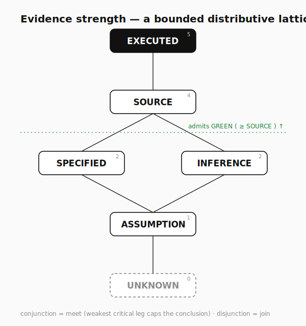
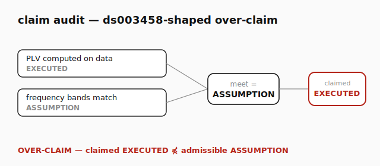

# The evidence lattice

A small, complete, machine-checked algebra for *verified delegation*: when may a
conclusion be called GREEN, and how strong is a conclusion built from premises?

<p align="center"></p>

Everything below is proven in code by `tests/test_evidence_lattice.py`
(21 tests, 16 of them Hypothesis property tests). The diagram is generated
deterministically by `python -m mh.viz`.

---

## 1. Carrier and order

Let **E = { UNKNOWN, ASSUMPTION, SPECIFIED, INFERENCE, SOURCE, EXECUTED }** be the
set of evidence classes, ordered by *epistemic strength*. The covering relation
⋖ is

```
UNKNOWN ⋖ ASSUMPTION ⋖ SPECIFIED ⋖ SOURCE ⋖ EXECUTED
                     ⋖ INFERENCE ⋖ SOURCE
```

i.e. SPECIFIED and INFERENCE are the two incomparable mid-strengths — a *contract*
and a *derivation* are different kinds of "not yet grounded", neither below the
other. The reflexive-transitive closure of ⋖ is the partial order ≤.

`a ≤ b` reads "a is no stronger than b". `EXECUTED` is the top ⊤ (verified by
running); `UNKNOWN` is the bottom ⊥ (no information).

## 2. (E, ≤) is a bounded distributive lattice

**Theorem 1.** Every pair a, b ∈ E has a least upper bound `join(a,b)` and a
greatest lower bound `meet(a,b)`; E has ⊤ and ⊥; and meet/join are mutually
distributive.

*Proof (machine-checked).* `is_bounded_lattice()` checks, for all pairs, that
`join`/`meet` are genuine LUB/GLB (every common upper bound dominates the join;
every common lower bound is dominated by the meet) and that ⊥ ≤ x ≤ ⊤.
Commutativity, associativity, idempotence, absorption and the
order↔join↔meet consistency `a ≤ b ⇔ join(a,b)=b ⇔ meet(a,b)=a` are property-
tested over random draws. `is_distributive()` checks
`meet(a, join(b,c)) = join(meet(a,b), meet(a,c))` and its dual for all triples;
it holds, so E contains no M3 or N5 sublattice. ∎

The single diamond `ASSUMPTION < {SPECIFIED, INFERENCE} < SOURCE` is the
two-element Boolean diamond, which is distributive; chaining it between two chains
preserves distributivity.

## 3. The two operational laws

The lattice is not decoration — two rules turn it into a discipline.

**Law A — fail-closed GREEN.** A critical claim may be GREEN only if its evidence
is at least SOURCE:

```
admits_green(e)  ⇔  e ≥ SOURCE
```

So exactly { SOURCE, EXECUTED } admit GREEN; SPECIFIED / INFERENCE / ASSUMPTION /
UNKNOWN do not. The green frontier is the dotted rule in the diagram.

**Law B — conjunction = meet.** A conclusion that depends on critical premises
p₁ … pₙ is no stronger than their meet:

```
conjunction_strength(p₁ … pₙ)  =  meet(p₁, …, pₙ)
```

**Proposition (weakest-leg).** For all premises, `conjunction_strength(P) ≤ pᵢ`
for every `pᵢ ∈ P`. *Proof.* meet is the GLB, hence ≤ each argument; property-
tested. ∎

**Corollary (no laundering).** `admits_green(meet(EXECUTED, ASSUMPTION))` is
**false**: a single ASSUMPTION leg caps the conjunction at ASSUMPTION, which is
below SOURCE. You cannot reach a GREEN conclusion by attaching one verified fact
to an unverified premise. This is coherence made arithmetic.

Dually, **disjunction = join** models *alternative* evidence paths: with two
independent routes to the same claim, the conclusion takes the *best* path,
`disjunction_strength(P) = join(P) ≥ pᵢ`.

## 4. Admissibility (over-claim detection)

A claim of strength `c` for a conclusion whose admissible strength is `a` is

```
is_admissible(c, a)  ⇔  c ≤ a
```

An **over-claim** is `¬ is_admissible(c, a)`. Crucially this catches not only
`c` strictly above `a`, but `c` **incomparable** to `a` (e.g. claiming INFERENCE
when only a SPECIFIED contract exists — `INFERENCE ⋠ SPECIFIED`). The earlier
"strictly-above" test missed that case; the fix is in `transfer_falsifier.py`.

<p align="center"></p>

The figure audits a `ds003458`-shaped inference: a phase-locking value is
`EXECUTED`, but the claim that the oscillator and EEG frequency bands match is
only `ASSUMPTION`. Their meet is ASSUMPTION; the paper claims EXECUTED;
`EXECUTED ⋠ ASSUMPTION`, so it is flagged an **over-claim** by the same law that
passes an all-`EXECUTED` software inference.

## 5. Prior art & what is (not) new

This is **not** a new uncertainty calculus. It is the minimal, runnable,
fail-closed *gate* one needs in practice, and it is intentionally weaker than:

- **Dempster–Shafer** belief functions and **Jøsang's subjective logic** — full
  algebras over belief/disbelief/uncertainty with fusion operators. Here we keep
  only a finite **strength lattice** and a meet-as-conjunction rule; there is no
  mass assignment and no fusion.
- **Provenance / lineage lattices** — `EXECUTED ▷ SOURCE ▷ …` is a provenance-
  strength order; the novelty is the *admissibility gate* on top of it.
- **Argumentation frameworks / paraconsistent logics** — the over-claim test is a
  one-line admissibility check, not a defeasible-reasoning engine.

The contribution is **operational and tested**: a fail-closed gate that refuses a
GREEN verdict whose weakest critical leg is too weak, with the algebra proven and
the audit visualised.

---

*Generated artifacts:* `docs/evidence_lattice.svg`, `docs/claim_audit_ds003458.svg`
(`python -m mh.viz`). *Proofs:* `tests/test_evidence_lattice.py`.
